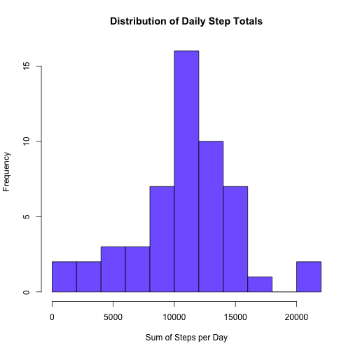
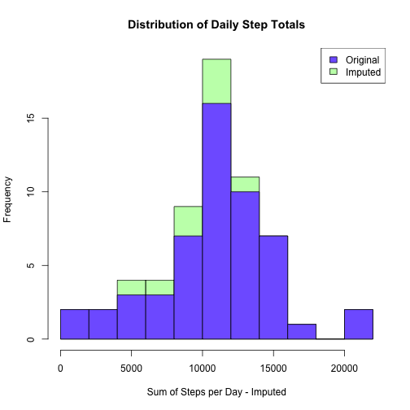
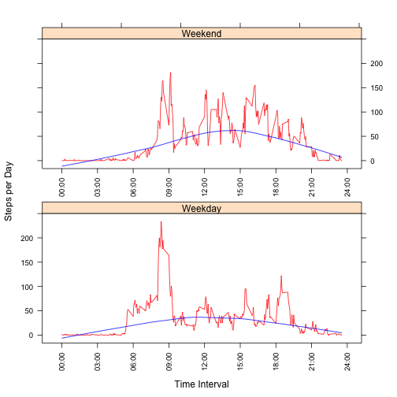

# Reproducible Research: Peer Assessment 1


## Loading and preprocessing the data

**Required libraries: plyr, lattice**


```r
require(plyr)
```

```
## Loading required package: plyr
```

```r
require(lattice)
```

```
## Loading required package: lattice
```

This program requires your working directory to be set to the directory of the repo; do so here.


```r
setwd("/Users/snoopy369/git/RepData_PeerAssessment1")
```

Read in the data using `read.csv`, and then convert the date field to a POSIXct date so it can be used later as a date.  No other manipulations are needed; the `interval` field is left as a number.


```r
actData <- read.csv(unz("activity.zip","activity.csv"))
actData$date = as.POSIXct(actData$date)
```

## What is mean total number of steps taken per day?

To calculate the mean number of steps taken per day, we first calculate `steps`, which is the per-day sum of steps.  This must leave `NA.RM=FALSE`, or the later mean will be skewed by zeros for the NA days.  Then, we average this.


```r
steps <- ddply(actData,.(date),summarize,sumSteps=sum(steps))
stepsAvs <- summarize(steps,meanSteps=mean(sumSteps,na.rm=TRUE),medianSteps=median(sumSteps,na.rm=TRUE))
rownames(stepsAvs)="Daily Average"
colnames(stepsAvs)=c("Mean Total Steps per Day","Median Total Steps per Day")
```


We can then view a histogram of the distribution of per-day step totals, and view the mean and median.  The distribution appears to roughly appear as a normal distribution, and the mean and median are nearly identical, suggesting that the data is not skewed.


```r
hist(steps$sumSteps,xlab="Sum of Steps per Day",main="Distribution of Daily Step Totals",breaks=10,col=rgb(.5,.4,1))
```

 


```
##               Mean Total Steps per Day Median Total Steps per Day
## Daily Average                    10766                      10765
```


## What is the average daily activity pattern?

To calculate the average daily activity pattern, we analyze the data across all days, grouped by time interval in 5 minute intervals (so, 00:00-00:05, etc.).  We use `ddply` to summarize the data in this fashion.

```r
dayAvs <- ddply(actData,.(interval),summarize,daySteps=mean(steps,na.rm=TRUE))
```

We can visualize this using a time series graph, and see how the activity fluctuates over the course of an average day.


```r
plot(type="l",x=dayAvs$interval, y=dayAvs$daySteps,xaxt="n",
     ylab="Average Steps at Time Interval Across Days",
     xlab="Time Intervals")

axis(side=1,at=seq(0,2400,300),lab=sprintf("%02d:00",seq(0,24,3)))
```

 

## Imputing missing values

To impute missing values, we use an average of similar cells method of imputation.  In this case, given the available data, we choose six similar days: two weeks ago, one week ago, one day ago, one day in the future, one week in the future, and two weeks in the future.  

So, for a day in the middle of our period (where there are all six values available), four of the six will be the same day of the week (which preserves any consistent effects caused by the day of the week) and two of the six will be from the immediate time window (preserving the effects from recency, such as if the subject were to have ramped up activity in a time period).  

For example, if we had July 1 as an NA day, we choose {June 17, June 24, June 30, July 2, July 8, July 15} as the set of days to impute from.  Across that set of days, we average the steps in each interval, so relationships related to time are preserved, and then fill in the NA value with that average.  

To accomplish this, we first compute a data frame of just the NA variables, and check to verify that there are no NAs in days that are not entirely NA.  We also view the total number of NAs.

```r
isnaData <- actData[is.na(actData$steps),]

##Checking that NAs are complete days only
check <- as.matrix(table(c(paste(isnaData$date))))
colnames(check)<-"Periods NA"
check
```

```
##            Periods NA
## 2012-10-01        288
## 2012-10-08        288
## 2012-11-01        288
## 2012-11-04        288
## 2012-11-09        288
## 2012-11-10        288
## 2012-11-14        288
## 2012-11-30        288
```

We see that all eight days have 288 missing values, which is consistent with all values being NA for those days (there are 12*24=288 five minute periods in a day).  The total is 2304.

Now, we create a large dataset (6 times as large as the original) with the six rows we will use for imputation. Each row preserves its date and interval values, but takes a steps row from either some number back or forward.  Once that is done, we summarize the dataset, which produces a dataset the same size as the original activity data frame.


```r
actForImpute <- rbind(actData,
    list(
      c(
        c(tail(actData$steps,-7*288),rep(NA,7*288)),
        c(tail(actData$steps,-14*288),rep(NA,14*288)),
        c(tail(actData$steps,-1*288),rep(NA,1*288)),
        c(rep(NA,7*288),head(actData$steps,-7*288)),
        c(rep(NA,14*288),head(actData$steps,-14*288)),  
        c(rep(NA,1*288),head(actData$steps,-1*288))
      ),
      c(actData$date,actData$date,actData$date,
        actData$date,actData$date,actData$date),
      c(actData$interval,actData$interval,actData$interval,
        actData$interval,actData$interval,actData$interval)
     )
)

imputeData <- rbind(actData[1,],ddply(actForImpute,.(date,interval),
                    summarize,steps=mean(steps,na.rm=TRUE)))[-1,]
```

After that is complete, we create a new data frame to hold the imputed values.  First, we create it by copying the original data frame, and then we copy the data from the `imputeData` data frame in for those rows that have NA values in `steps`.


```r
actImputed<-actData

#Where it has NAs, populate with imputation data
actImputed[is.na(actImputed$steps),"steps"] <- 
  imputeData[is.na(actImputed$steps),"steps"]
```

We now display the imputed dataset with a histogram that overlays the imputed frequencies in green with the original frequencies in purple.  We also display the old and new mean and median for reference.  We see that the distribution stays roughly the same, imputing into the middle of the distribution as you would expect with a good imputation scheme.  You also see a slight dip in the mean, which may be due to a skewness related to days of the week (as the NA days are predominantly weekdays, which potentially could have lower frequencies than weekdays if the wearer has a desk job).


```r
stepsImputed <- ddply(actImputed,.(date),summarize,sumSteps=sum(steps))
stepsImputedAvs <- summarize(stepsImputed,meanSteps=mean(sumSteps,na.rm=TRUE),medianSteps=median(sumSteps,na.rm=TRUE))
rownames(stepsImputedAvs)="Daily Average - Imputed"
colnames(stepsImputedAvs)=c("Mean Total Steps per Day","Median Total Steps per Day")

stepsAvs
```

```
##               Mean Total Steps per Day Median Total Steps per Day
## Daily Average                    10766                      10765
```

```r
stepsImputedAvs
```

```
##                         Mean Total Steps per Day
## Daily Average - Imputed                    10638
##                         Median Total Steps per Day
## Daily Average - Imputed                      10765
```

```r
hist(stepsImputed$sumSteps,xlab="Sum of Steps per Day - Imputed",main="Distribution of Daily Step Totals",breaks=10,col=rgb(.5,1,.4,.5))
hist(steps$sumSteps,xlab="Sum of Steps per Day - Imputed",main="Distribution of Daily Step Totals",breaks=10,col=rgb(.5,.4,1,1),add=T)
legend(x="topright",legend=c("Original","Imputed"),fill=c(rgb(.5,.4,1,1),rgb(.5,1,.4,.5)))
```

 
## Are there differences in activity patterns between weekdays and weekends?

To determine if there are differences in weekday versus weekend step counts, we first must add a variable to our imputed dataset that indicates if a record comes from the weekday or weekend.  This is why we coded our date as `POSIXct`, as it can be used with the `weekdays` function.  (`POSIXlt` would include this as a class member, but we find `POSIXct` to be generally easier to work with and so prefer it.)


```r
actImputed$dayType <- as.factor(
      weekdays(actImputed$date) %in% c("Saturday","Sunday"))

levels(actImputed$dayType) <- c("Weekday","Weekend")
```

Then we create a summarized dataset that combines the interval and the weekday/weekend type variable, and plot it in a trellis plot that shows the two line charts opposite one another.  We also include a loess smoothing line to more easily see the overall shape of the data, as this data is very jumpy due to the nature of the data.


```r
dayAvsType <- ddply(actImputed,.(interval,dayType),summarize,daySteps=mean(steps,na.rm=TRUE))
axis.hours <-
    function(side, ...) 
{
    ylim <- current.panel.limits()$ylim
    switch(side,
           "bottom" = {
               lab <- sprintf("%02d:00",seq(0,24,3))
               panel.axis(side = side, outside = TRUE,
                          at = seq(0,2400,300), labels = lab)
           },
           axis.default(side = side, ...))
}
xyplot(data=dayAvsType,daySteps~interval|dayType,
       panel = function(...) {
         panel.xyplot(...,col="red",type="l")
         panel.loess(...,col="blue")
       },layout=c(1,2),ylab="Steps per Day", xlab="Time Interval",
        axis=axis.hours,
        between = list(y = 3),
      par.settings = list(layout.heights = list(axis.xlab.padding=4))
       ) 
```

 

From this we can see that while Weekday has the largest single spike, Weekend overall has substantially more steps, with a large portion of the day over 50 steps per five minute period.  This is logical, given the user may have a desk job and have few opportunities for walking except for a small spike at lunch and larger ones near the end of the day. 
